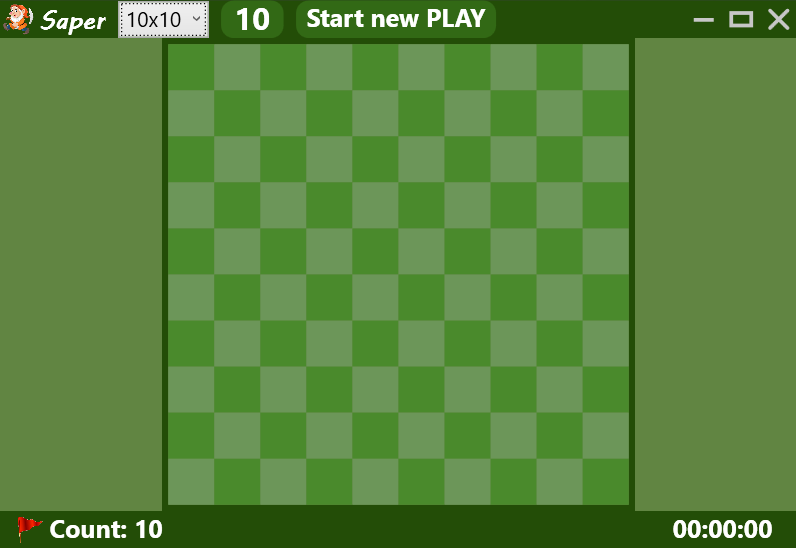
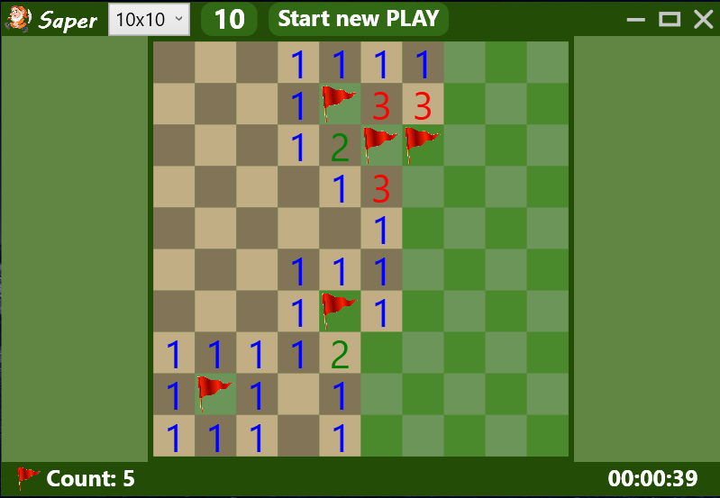
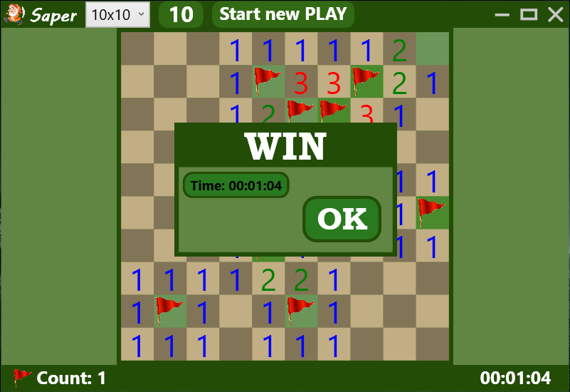
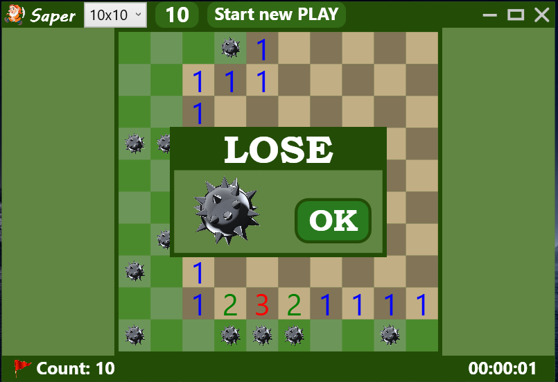
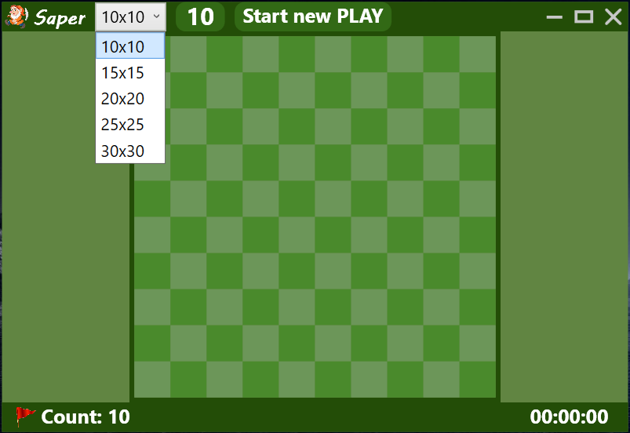
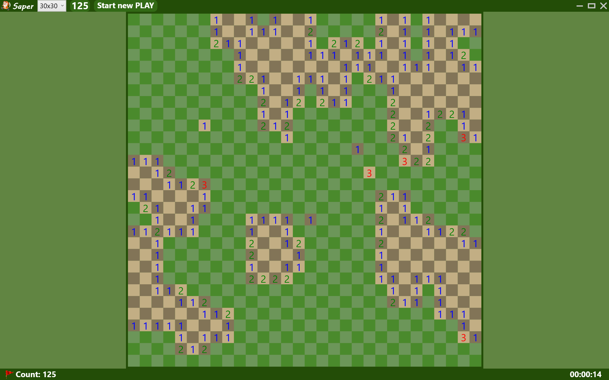

# Игра сапёр. Desktop приложение.

Проект на каникулы в компьютерной академии.

___

Реализовано:

1. Генерация уровней
2. Логика игры Сапёр.
3. Изменение размера поля и количества мин.

___

Для запуска скопировать папку `Resources` в папку с исполняемым файлом.

